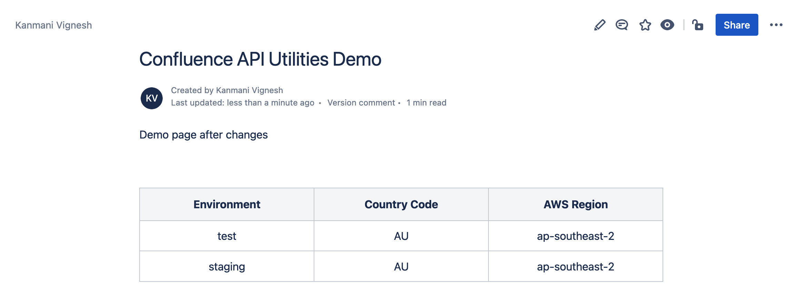

# Confluence API Scripts
## Pre-requisites

- Install Python pre-requisites with ```pip3 install -r requirements.txt```.
- Generate your Confluence API Key from https://id.atlassian.com/manage-profile/security/api-tokens.

## Read Confluence Page

The script confluence-read.py will read contents from the given confluence page.

```
./confluence-read.py -h
usage: confluence-read.py [-h] -u USER -p PASSWORD -s SITE pageid

positional arguments:
  pageid                Specify the Conflunce page id to read

optional arguments:
  -h, --help            show this help message and exit
  -u USER, --user USER  Specify the username to log into Confluence
  -p PASSWORD, --password PASSWORD
                        Specify the api-key to access Confluence
  -s SITE, --site SITE  Specify the Conflunce site URL
```

Example:
```
./confluence-read.py -u yourconfluenceuser@yourdomain.com -p your-confluence-api-key -s https://yourdomain.atlassian.net pageid
```

### Sample Run

You can find the sample run and the sample output below:
```
$ ./confluence-read.py -u kansvignesh@gmail.com -p `cat apikey.secret` -s https://kansvignesh.atlassian.net 98398
{'id': '98398', 'type': 'page', 'status': 'current', 'title': 'Confluence API Utilities Demo', 'macroRenderedOutput': {}, 'body': {'storage': {'value': '<p>Demo page before any changes</p>', 'representation': 'storage', 'embeddedContent': [], '_expandable': {'content': '/rest/api/content/98398'}}, '_expandable': {'editor': '', 'atlas_doc_format': '', 'view': '', 'export_view': '', 'styled_view': '', 'dynamic': '', 'editor2': '', 'anonymous_export_view': ''}}, 'extensions': {'position': 967}, '_expandable': {'container': '/rest/api/space/~7120206e4e524eb4ea4d01bf6a9776683bacf3', 'metadata': '', 'restrictions': '/rest/api/content/98398/restriction/byOperation', 'history': '/rest/api/content/98398/history', 'version': '', 'descendants': '/rest/api/content/98398/descendant', 'space': '/rest/api/space/~7120206e4e524eb4ea4d01bf6a9776683bacf3', 'childTypes': '', 'schedulePublishInfo': '', 'operations': '', 'schedulePublishDate': '', 'children': '/rest/api/content/98398/child', 'ancestors': ''}, '_links': {'editui': '/pages/resumedraft.action?draftId=98398', 'webui': '/spaces/~7120206e4e524eb4ea4d01bf6a9776683bacf3/pages/98398/Confluence+API+Utilities+Demo', 'context': '/wiki', 'self': 'https://kansvignesh.atlassian.net/wiki/rest/api/content/98398', 'tinyui': '/x/XoAB', 'collection': '/rest/api/content', 'base': 'https://kansvignesh.atlassian.net/wiki'}}
```

## Update Confluence Page

```
$ ./confluence-update.py -h
vusage: confluence-update.py [-h] -u USER -p PASSWORD -s SITE [-t TITLE] -f FILE pageid

positional arguments:
  pageid                Specify the Conflunce page id to overwrite

optional arguments:
  -h, --help            show this help message and exit
  -u USER, --user USER  Specify the username to log into Confluence
  -p PASSWORD, --password PASSWORD
                        Specify the api-key to access Confluence
  -s SITE, --site SITE  Specify the Conflunce site URL
  -t TITLE, --title TITLE
                        Specify a new title
  -f FILE, --file FILE  Write the contents of FILE to the confluence page
```

Example:
```
./confluence-update.py -u yourconfluenceuser@yourdomain.com -t 'Your Page Title' -f yourinputfile -s https://yourdomain.atlassian.net pageid
```

### Sample Run
- Run confluence-update script - the [sample-input](./sample-input.html) contains a paragraph and a table:
```
$ ./confluence-update.py -u kansvignesh@gmail.com -p `cat apikey.secret` -s https://kansvignesh.atlassian.net -f sample-input.html 98398
Wrote 'Confluence API Utilities Demo' version 6
URL: https://kansvignesh.atlassian.net/wiki/pages/viewpage.action?pageId=98398
```

- Confluence Page after the update:



## Other Notes
- You can store your secrets in keyring and use it in your code. Stored keyring secrets can be validated with the below command:
```
python3 -m keyring get confluence_script vignesh.narasimhulu@teletracnavman.com
```

Thanks.
